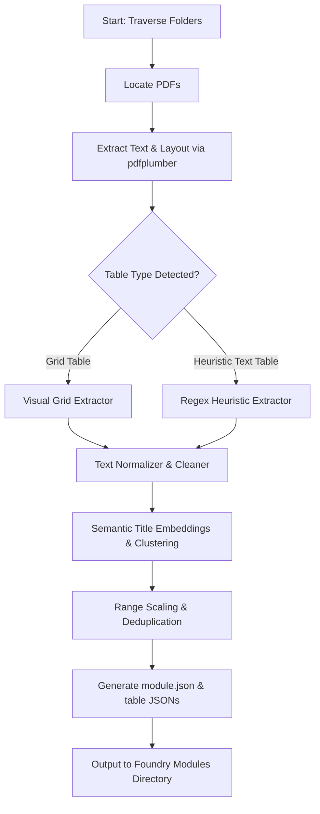

# VTT-TableForge: Automated PDF Random Table Extractor & FoundryVTT v14 Module Generator

This plan outlines the architecture, data structures, and implementation steps for **VTT-TableForge**, a hybrid utility designed to recursively extract RPG random tables from PDF files, clean typographical and layout anomalies, semantically consolidate tables of similar topics, and bundle them into an installable **FoundryVTT v14 compatible module** with a premium, VTT-native importer UI.

---

## User Review Required: Detailed Reorganization, Change_List.md & Auto-Folders

To address your new structural requirements, the screenshot folders, and the detailed changes requested in [Change_List.md](file:///d:/OneDrive/DnD/Reference%20Documents/Random%20(Tables,%20etc)/Change_List.md), we have expanded our technical proposal.

---

### Proposal A: Natural Theme Subfolders for Master Combined Tables
To keep `tables/combined/` perfectly organized and directly aligned with your actual Foundry directory layout shown in the screenshot, we propose automatically grouping Master tables into these clean, standardized theme folders:

* `tables/combined/downtime/` - Tavern activities, gambling, carousing, downtime events.
* `tables/combined/encounters/` - Travel events, traps, hazards, wilderness encounters, weather.
* `tables/combined/items/` - Weapons, armor, mundane items, drugs, gear.
* `tables/combined/magic/` - Magic items, scrolls, potions, spells, arcane anomalies.
* `tables/combined/monsters/` - Lair actions, monster lists, creature stats.
* `tables/combined/npcs/` - Names, traits, insults, rumors, secrets, descriptions.
* `tables/combined/world_building/` - Town/tavern names, room generators, plot hooks, world lore.
* `tables/combined/running_the_game/` - Travel rules, rules modifiers, weather shifts, pacing adjustments.

The classifier inside `tableforge.py` will assign tables to these folders based on keyword analysis of the semantic master topic (e.g., matching "insult" or "name" maps it to `npcs/`).

---

### Proposal B: Five-Item Change_List.md Resolution

We will implement the following solutions to address all items in [Change_List.md](file:///d:/OneDrive/DnD/Reference%20Documents/Random%20(Tables,%20etc)/Change_List.md):

#### 1. Rename Workspace & Local Folders
* **Rename Folder on Disk:** We will rename the folder `Random (Tables, etc)` to `Random Tables` on your local system.
* **Update Environment Config:** We will automatically edit the `PDF_FOLDERS` path in [.env](file:///d:/OneDrive/DnD/Reference%20Documents/Random%20(Tables,%20etc)/.env) to use `Random Tables\Tables` so the path mapping remains intact.
* **Update Script Defaults:** The internal defaults inside `tableforge.py` will be changed to reflect `Random Tables`.

#### 2. Remove Duplicate Source Book Tables
* **Clean Tracker Database:** We will parse [tableforge_tracker.json](file:///d:/OneDrive/DnD/Reference%20Documents/Random%20(Tables,%20etc)/tableforge_tracker.json) and completely erase the entry for `greatbookofrandomtables(shorter).pdf` so it is not processed or tracked.
* **Wipe Duplicate Tables:** We will write a utility that scans the generated `C:\FoundryVtt\Data\modules\vtt-tableforge\data\tables\` directory and purges any table `.json` file containing metadata showing it originated from `greatbookofrandomtables(shorter).pdf`.

#### 3. High-Fidelity Table Extraction & Surrounding Descriptions
* **Preceding/Trailing Context Parser:** We will upgrade the visual Gemini prompt in `tableforge.py` to analyze text layout preceding and succeeding the tables.
* **Rule Extraction:** Instead of extracting generic titles like `1x`, Gemini will:
  1. Capture the true, complete title of the table header (e.g., `OVERLAND TRAVEL` rather than formula lines like `1x / day`).
  2. Assemble introductory rule text (e.g., pace modifications, combat calculations, encounter rolls) and format them into a single cleaned string under the table's `"description"` field.
* **Foundry Compatibility:** The compiled RollTable schema inside the JSON files will now correctly map this raw data to the native `"description"` field so they show up beautifully inside the Foundry VTT sheet!

#### 4. Enable Module Buttons & Sidebar Visibility (Foundry Config Fix)
* **The Root Cause:** The console error `Failed to parse URL from "C:\FoundryVtt\Data\modules\vtt-tableforge\module.json"` occurs because Foundry's "Install Module" dialog expects a web URL. Pasting a local Windows file path there crashes the browser's URL parser.
* **The Correction:** Since `tableforge.py` compiles files directly inside `C:\FoundryVtt\Data\modules\vtt-tableforge\`, the module **is already fully installed on your disk**.
  * **To Activate:** Simply launch your world, go to **Game Settings -> Manage Modules**, locate **"VTT TableForge: Cleaned & Extracted Random Tables"**, check the box, and click **Save Module Settings**.
* **Modernized Injector Hook:** We will also upgrade the JS hook inside the script's `importer.js` template to dynamically target both `.header-actions.action-buttons` and `.directory-header` to guarantee perfect sidebar button injection on Foundry v14.

#### 5. Auto-Import with Subfolders & Compendiums (No Sidebar Bloat!)
To handle the high volume of tables (over 3,500) and preserve game performance, we will expand `importer.js` to natively support two automated import paths inside Foundry VTT:
* **Option A: Organized Sidebar Import (Recreate Folder Tree)**
  * The importer will programmatically scan the paths in `metadata.json` (e.g., `individual/advanced_weather_table/`).
  * It will recursively create matching `Folder` documents in your Rollable Tables tab (e.g., `TableForge (Individual) -> Advanced Weather Table`).
  * The tables will be placed directly in their designated subfolders automatically.
* **Option B: Organized World Compendium Import (Recommended)**
  * The Importer UI will feature a **"Create World Compendium"** button.
  * Clicking this programmatically creates a custom Compendium Pack in your world (e.g., `TableForge: Extracted Tables`).
  * It will dynamically build the nested folder tree *inside* that compendium pack and store the tables inside it, leaving your active sidebar clean and performant!

---

## Approved User Specifications

The following key design choices have been aligned and will be implemented in the tool:

> [!NOTE]
> **1. Adaptive PDF Parsing & Intelligent OCR Fallback**
> The tool will implement an **adaptive pipeline**. It will first attempt to extract text using standard fast vector-layout parsing. If it detects a scanned page or image-only document (e.g., character count is zero or below a density threshold), it will automatically initiate OCR. When Gemini is enabled, we will utilize **Gemini's built-in vision and layout-understanding** to perform OCR, which is far superior to local libraries like Tesseract and requires no local system dependencies.

> [!NOTE]
> **2. Output Target Path**
> The local utility will deploy the generated module directly into:
> `C:\FoundryVtt\Data\modules\vtt-tableforge`
> This means that once the script finishes running, you can immediately open your Foundry VTT v14 launcher, enable the module in your world, and import the tables without any manual copying.

> [!NOTE]
> **3. Table Hierarchy and Consolidation**
> We will preserve your original extracted tables individually (e.g., "100 Fantasy Drugs (Book A)" and "100 Fantasy Drugs (Book B)") but *also* create:
> *   **Master Combined Tables**: A combined table (e.g., a single large `d200` table) merging all unique entries and deduplicating highly similar items.
> *   **Hierarchical Table Links**: Foundry VTT allows table results to be *links* to other tables. We will generate master category tables (e.g., "Master Magic Items") that roll on sub-tables (like "Rare Magic Items" or "Uncommon Magic Swords") based on your rules, creating a premium virtual tabletop experience.

> [!NOTE]
> **4. Gemini API Integration (Free-Tier & Zero Cost)**
> We will implement **Google Gemini API** support as the primary engine, with a local NLP (Levenshtein/TF-IDF) processor as a fallback.
> *   **Why use Gemini Pro?**
>     *   *True Semantic Understanding*: It recognizes that "Tavern Insults" and "Barroom Jeers" are identical topics, even if they share zero identical words, whereas local keyword matchers would keep them separate.
>     *   *Layout & Typography Restoration*: D&D tables often have split words (e.g. `w e a p o n`, `long- sword`) due to multi-column PDF layouts. Gemini instantly restores perfect grammar and spelling.
>     *   *OCR Integration*: Bypasses the need to install external Windows binaries like Ghostscript or Tesseract by letting Gemini do the image-to-table conversion natively.
> *   **Zero Cost**: You can generate a **free API key** via Google AI Studio (`aistudio.google.com`) using your existing Google account. For personal/development use, this key operates on a free tier with high rate limits, resulting in **$0 cost** to you.

---

## Proposed Changes

### Component 1: Local PDF Extractor & Parser (Python Script)

A standalone Python utility (`tableforge.py`) that will handle file traversal, document scanning, table extraction, text normalization, and semantic merging.



#### Key Capabilities:
1. **Dual-Extraction Engine**:
   - **Grid Extractor**: Detects and parses standard bordered tables with column lines.
   - **Heuristic RPG Extractor**: Scans text line-by-line for D&D-style random patterns (e.g., `^\s*(?<range>\d+(?:-\d+)?)\.?\s+(?<text>.+)$` matching ranges like `1-5` or `97` followed by description). Contiguous matching lines are parsed as table rows.
2. **Text Normalizer**:
   - Cleans ligature artifacts (e.g., `fi` getting split to `f i`, or weird character encoding).
   - Recombines split words and hyphenated line ends.
   - Removes page running headers, footers, and page numbers.
3. **Semantic Clusterer**:
   - Computes text similarity across table titles (e.g., "100 Tavern Insults" and "Table of Insults" both cluster under "Insults").
   - Merges entries, deduplicates highly similar lines, and re-allocates roll ranges to ensure they are contiguous and mathematically correct.

---

### Component 2: Generated FoundryVTT Module

The output of the Python script is a complete, installable FoundryVTT module structure:

```
vtt-tableforge/
├── module.json
├── styles.css
├── scripts/
│   └── importer.js
└── data/
    ├── metadata.json           # Catalog of all tables, categories, and file mapping
    └── tables/
        ├── combined/           # Consolidated master tables (e.g. master_tavern_insults_combined.json)
        └── individual/         # Original individual tables grouped by source PDF folder
```

#### [NEW] [module.json](file:///d:/OneDrive/DnD/Reference%20Documents/Random%20(Tables,%20etc)/vtt-tableforge/module.json)
This manifest registers the module, declares its compatibility with Foundry VTT v14, and loads the CSS styling and javascript client code.
```json
{
  "id": "vtt-tableforge",
  "title": "VTT TableForge: Cleaned & Extracted Random Tables",
  "description": "Custom module containing rollable tables parsed and consolidated from local PDF reference documents.",
  "version": "1.0.0",
  "compatibility": {
    "minimum": "12",
    "verified": "14"
  },
  "esmodules": ["scripts/importer.js"],
  "styles": ["styles.css"]
}
```

#### [NEW] [importer.js](file:///d:/OneDrive/DnD/Reference%20Documents/Random%20(Tables,%20etc)/vtt-tableforge/scripts/importer.js)
A lightweight ES module that hooks into Foundry's rendering pipeline. It adds a "TableForge Importer" button to the Rollable Tables sidebar. When clicked, it renders a high-end import UI:

```javascript
Hooks.on("renderRollTableDirectory", (app, html, data) => {
  if (!game.user.isGM) return;
  
  // Check if our button already exists to prevent duplicate injections
  if (html.find(".tableforge-import-btn").length > 0) return;
  
  const importBtn = $(`
    <button class="tableforge-import-btn" title="Import Extracted Tables">
      <i class="fas fa-file-pdf"></i> TableForge Importer
    </button>
  `);
  
  importBtn.on("click", (event) => {
    event.preventDefault();
    new TableForgeImporterDialog().render(true);
  });
  
  html.find(".directory-header .action-buttons").append(importBtn);
});
```

---

### Component 3: Premium In-World Importer UI (`TableForgeImporterDialog`)

The importer dialog will use **modern Foundry VTT design systems** (incorporating HSL tailored palettes, elegant dark-mode glassmorphism, responsive columns, and subtle CSS transitions):

1. **Table Selector**:
   - Search bar to instantly filter tables by name or content.
   - Category filters (e.g. "Weapons", "Names", "Environment", "NPCs", "Consolidated").
2. **Interactive Preview Sidebar**:
   - Clicking a table loads a live preview panel showing the table's meta-data (original PDF source, item count, roll formula) and a scrollable table of the first 10 results.
3. **Safe Imports**:
   - Checkboxes next to each table.
   - Dropdown options for duplicate handling: **"Skip Existing"**, **"Overwrite Existing"**, or **"Merge into Existing"**.
   - An "Import Selected" action button with progress bar animations.

### Component 4: Future-Proof Metadata & Advanced Weighting Architecture

To support assigning different weights based on adjectives or fields (e.g., rarity) during compilation or dynamically in Foundry, we will implement the following:

1. **Metadata Tagging via Flags (JSON Level)**:
   The Python table parser (utilizing Gemini Pro) will extract metadata fields from each table result (e.g., `Rarity`, `Item Type`, `Source PDF`) and store them cleanly in the native Foundry `flags` block for each result row.
   ```json
   {
     "type": 0,
     "text": "Flame Tongue Longsword (Rare)",
     "weight": 1,
     "range": [1, 1],
     "flags": {
       "vtt-tableforge": {
         "metadata": {
           "rarity": "Rare",
           "type": "Weapon",
           "subtype": "Sword"
         }
       }
     }
   }
   ```

2. **Static Weight Compilation (Local Configuration)**:
   A Python-side configuration file `weight_config.json` allows defining pre-set weight multipliers for specific metadata attributes during export:
   ```json
   {
     "rarity": {
       "Common": 1024,
       "Uncommon": 256,
       "Rare": 64,
       "Very Rare": 16,
       "Legendary": 4,
       "Artifact": 1
     }
   }
   ```
   If enabled, the Python script automatically calculates the ranges mathematically and compiles these static weights directly into the exported module files.

3. **Dynamic VTT UI Weighted Roller (Module Level)**:
   We will reserve hooks and structure the module script to allow rendering a **"Weighted Roll"** interface.
   *   **Auto-detect Attributes**: The UI scans the selected table's results, inspects their custom `flags.vtt-tableforge.metadata` tags, and auto-generates filters/sliders for whatever attributes exist.
   *   **Real-time Modifiers**: The GM can adjust sliders/multipliers (e.g., Common = `4x`, Legendary = `0x`) in the custom rolling panel to perform temporary rolls using these custom weight ratios.
   *   **Write-Back to Table**: A "Save Weights" button will recalculate the actual Foundry `weight` and `range` fields on the native Rollable Table in their world, saving them permanently so that standard rolls (via standard sheet clicks or other modules) automatically respect the new custom weights.

---

## Verification Plan

### Automated/Local Tests
- **Extraction Check**: Run the parsing script on a subset of PDFs (e.g., `Jamjie's_Book_of_Odds.pdf`) and verify that visual and text-based tables are accurately captured into a structured raw JSON format.
- **Cleaning Test**: Validate that ligatures (e.g., `fl`, `fi`) and misplaced spaces (e.g., `d a m a g e` or word splits across lines) are corrected.
- **Deduplication Check**: Run semantic clustering on duplicate tables (like Tavern Insults) and verify that the results are merged, ranges are contiguous, and duplicates are removed.
- **Foundry JSON Schema Validator**: Verify that generated JSON files exactly match Foundry VTT's `RollTable` schema (including `range` array, `weight`, `type: 0` for text, etc.).

### Manual Verification in Foundry VTT
1. **Module Loading**: Deploy the generated module to the local FoundryVTT `modules` directory and verify it is discoverable in the Module management screen.
2. **UI Injection**: Enable the module, open a world, and verify the "TableForge Importer" button displays correctly in the Rollable Tables sidebar.
3. **Import Execution**: Click the button, select multiple tables, and click Import. Check that:
   - Rollable Tables are correctly created in the world's directory.
   - The formula is correctly set (e.g., `1d100` or `1d25`).
   - Results are rollable and yield correct chat cards.
